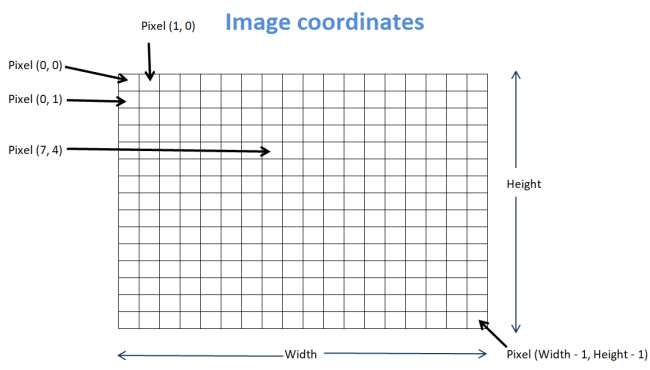
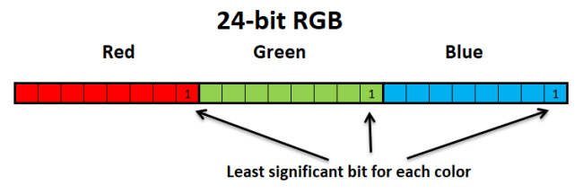

# Indigo Card Game
Stage 2 of 4 for JetBrains Academy - Kotlin - [Steganography and Cryptography project](https://hyperskill.org/projects/160/stages/831/implement).   
This stage has us practice reading an image file, changing the pixels, and saving the changes to a file.
### Description
Before we can get to actually concealing a message in an image, we need to learn how to handle images. In this stage, we will work on the command `hide`.

For our purposes, the image has to be in a lossless format. "Lossless" implies that the pixel values don't change when the image is saved and compressed. We are going to work with the **PNG** image format. Other known formats such as JPG use lossy compression image format, which would corrupt the hidden message.

Images can be viewed as 2-dimensional arrays. In the picture below, you can see the image coordinate system:    
    
A 24-bit image offers more than 16 million colors for every pixel. If the RGB color scheme is used, then 8 bits (values 0–255) represent the Red, Green, and Blue colors. If the least significant bits of these 8-bit values change, the difference in the image will remain unnoticed. This is exactly what we will use for hiding our message in the next stages. In this stage, our program needs to set the **least significant bit** for each color of each pixel of the input image to the value `1`.    
    
Java classes `BufferedImage`, `ImageIO`, and `Color` (`java.awt.image.BufferedImage`, `javax.imageio.ImageIO`, and `java.awt.Color`) should be used for reading/writing and changing the images.

With the `BufferedImage` class methods, the image pixels can be accessed as a **2-dimensional array**. Also, note that the type `BufferedImage.TYPE_INT_RGB` should be used for 24-bit color with the `BufferedImage` class.

You may find it helpful to look at some examples of the [BufferedImage](https://www.tutorialspoint.com/java_dip/java_buffered_image.htm), [ImageIO](https://www.tutorialspoint.com/How-to-convert-Byte-Array-to-Image-in-java), and [Color](https://www.tutorialspoint.com/java_dip/understand_image_pixels.htm) classes.

Finally, I/O operations can easily fail. However, the program should not stop when an I/O exception occurs, for example, if a wrong input filename is given, so all I/O exceptions should be handled.
### Objectives
When the user inputs the command `hide`, the program should prompt them for an input image filename with the message `Input image file:` and an output image filename with the message `Output image file:`. These should be used for reading the input image file and writing the output image file, respectively.

After reading the filenames, the program should print the following messages: `Input Image: [input filename]` and `Output Image: [output filename]`.

When the input image is read, the least significant bit for each color (Red, Green, and Blue) is set to 1. The resulting image will be saved with the provided output image filename in the PNG format.

A proper method should be applied so that the I/O exceptions do not terminate the program. In such cases, an exception message should be printed and the program should return to the command loop.    
### Examples
The greater-than symbol followed by a space (`> `) represents the user input. Note that it's not part of the input.
#### Example 1: Normal execution.
```text
Task (hide, show, exit):
> hide
Input image file:
> winter.png
Output image file:
> image.png
Input Image: winter.png
Output Image: image.png
Image image.png is saved.
Task (hide, show, exit):
> exit
Bye!
```
#### Example 2: Input file does not exist, an exception is caught.
```text
Task (hide, show, exit):
> hide
Input image file:
> notexist.png
Output image file:
> image.png
Can't read input file!
Task (hide, show, exit):
> exit
Bye!
```