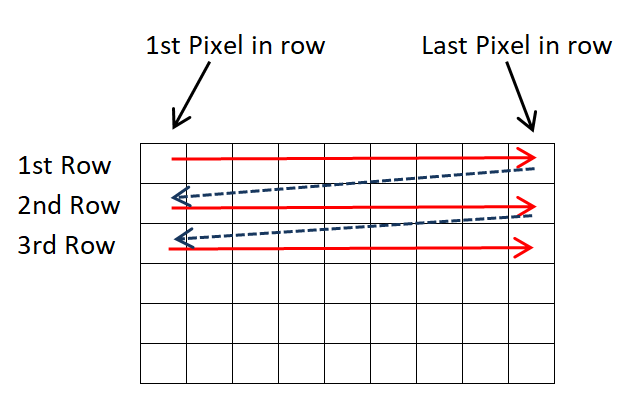
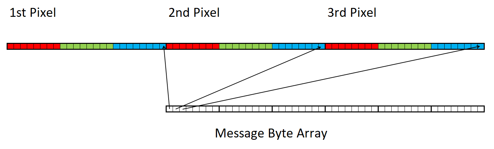

# Steganography and Cryptography
Stage 3 of 4 for JetBrains Academy - Kotlin - [Steganography and Cryptography project](https://hyperskill.org/projects/160/stages/832/implement).   
This stage has us hide the message one bit at a time within the color blue of each pixel needed.
### Description
Steganography is about hiding information in such a way that no-one would ever guess there's a secret message hidden right before their eyes. The method we are going to use for concealing a message in an image is based on slight color changes that can’t be detected.

As you already know, the message data can be inserted at the positions of the least significant bits of each color value of each pixel. That makes 3 bits per pixel and a total of 3*[image width]*[image height] bits for the whole image. Of course, there is no need to use all of them: it would be more efficient to have an algorithm that picks which bits to use. We could make it even more complex: the bit selection can be based on a password so that the configuration is different every time the password is changed.

However, to keep things simple, in this project, we will use only the least significant bits of the blue color of each pixel. Thus, each image can hold up to [image width]*[image height] bits.

As seen in the previous stage, images can be handled as 2-dimensional arrays. In this stage, the order of pixels should be left to right in the first row and then the same for each consecutive row. The picture below illustrates the order:       
     
The message to hide has the String type and UTF-8 charset. As a result, the message can be in any language. In order to conceal the secret message, we have to first convert it to an Array of Bytes: you can do it with the `encodeToByteArray()` function. Respectively, an array of bytes can be restored to the String type by applying `toString(Charsets.UTF_8)`.

When the program reads the image bits in order to reconstruct the message, it has to know when to stop, that is, when it has read the entire message. For this, certain bytes should be applied at the end of the Bytes Array. Specifically, we will add three bytes with values 0, 0, 3 (or 00000000 00000000 00000011 in the binary format). When the program encounters these bytes, it will know that it has reached the end of the message.
### Objectives
When the `hide` command is given, the program gets the input and output image filenames as in the previous stage. Then, it prompts the user for the secret message by printing `Message to hide:`.

The message should be converted to an array of bytes. Then, 3 bytes with the values 0, 0, 3 should be added at the end of the array.

The program should check that the image size is adequate for holding the Bytes array. If not, it should print an error message with the text `The input image is not large enough to hold this message.` and return to the menu.

Each bit of this Bytes Array will be saved at the position of the least significant bit of the blue color of each pixel, as shown in the picture below. The output image should be saved in the PNG format.    
    
When the `show` command is given, the program asks for the image filename (previously saved with the hidden message) by printing `Input image file:`. The image will be opened and the Bytes Array will be reconstructed bit by bit; the program will stop reading it when the bytes with the values 0, 0, 3 are encountered.

The last 3 bytes (values 0, 0, 3) should be removed from the end of the Bytes Array. Then, the message should be restored as a String from the Bytes Array (or 00000000 00000000 00000011 bits).

The program should print `Message:` and then the message itself on a new line.
### Examples
The greater-than symbol followed by a space (`> `) represents the user input. Note that it's not part of the input.
#### Example 1: Hiding and extracting a message.
```text
Task (hide, show, exit):
> hide
Input image file:
> sky.png
Output image file:
> hide.png
Message to hide:
> Hello World!
Message saved in hide.png image.
Task (hide, show, exit):
> show
Input image file:
> hide.png
Message:
Hello World!
Task (hide, show, exit):
> exit
Bye!
```
#### Example 2: Hiding messages in a very small image.
```text
Task (hide, show, exit):
> hide
Input image file:
> small.png
Output image file:
> out1.png
Message to hide:
> 123
Message saved in out1.png image.
Task (hide, show, exit):
> hide
Input image file:
> small.png
Output image file:
> out2.png
Message to hide:
> abcdefghijk
The input image is not large enough to hold this message.
Task (hide, show, exit):
> exit
Bye!
```